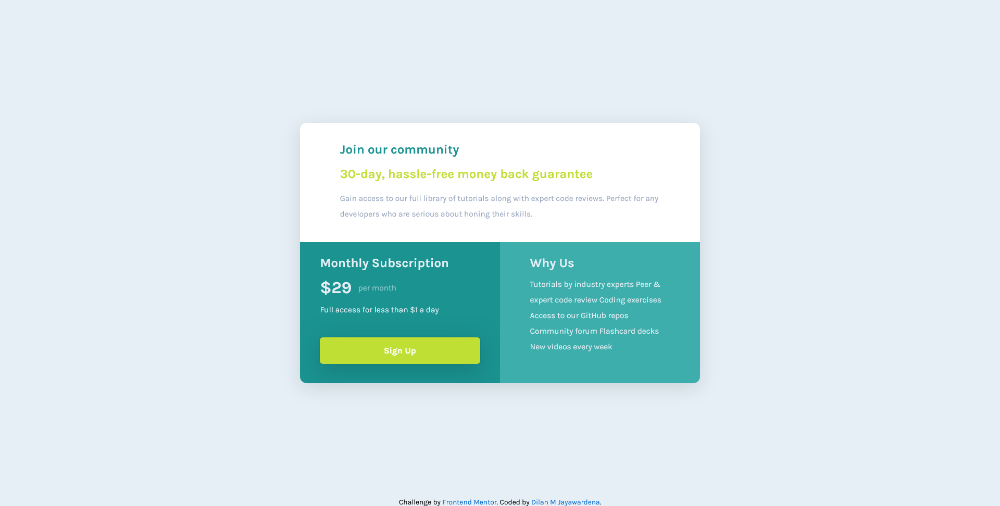

# Frontend Mentor - Single price grid component solution

This is a solution to the [Single price grid component challenge on Frontend Mentor](https://www.frontendmentor.io/challenges/single-price-grid-component-5ce41129d0ff452fec5abbbc). Frontend Mentor challenges help you improve your coding skills by building realistic projects. 

## Table of contents

- [Overview](#overview)
  - [The challenge](#the-challenge)
  - [Screenshot](#screenshot)
  - [Links](#links)
- [My process](#my-process)
  - [Built with](#built-with)
  - [What I learned](#what-i-learned)
  - [Useful resources](#useful-resources)
- [Author](#author)


## Overview

### The challenge

Users should be able to:

- View the optimal layout for the component depending on their device's screen size
- See a hover state on desktop for the Sign Up call-to-action

### Screenshot




### Links

- Live Site URL: [Add live site URL here](https://your-live-site-url.com)

## My process

### Built with

- CSS custom properties
- Flexbox
- CSS Grid
- Mobile-first workflow


### What I learned

This is the first time I apply css grid to my css/ scss styling, When creating responsive layout, it helped me a lot, I am planning to learn more and practice more with css Grid.

To see how you can add code snippets, see below:

```html
 <!-- mian container -->
  <div class="main-cont">
    <div class="main-cont__el-1">

      <!-- section one -->
      <div class="main-cont__el-1-outer">
        
        <h2> Join our community</h2>
        
        <h3>30-day, hassle-free money back guarantee</h3>
        
        <p>
           Gain access to our full library of tutorials along with expert code reviews. 
          Perfect for any developers who are serious about honing their skills.
        </p>
      </div>
    </div>

    <!-- section two -->
    <div class="main-cont__el-2">
      <div class="main-cont__el-2-outer">

        <h2>Monthly Subscription</h2>
        
        <p id="price"><span>&dollar;29</span> per month</p>
        
        <p>Full access for less than &dollar;1 a day</p>
        
        <button>Sign Up</button>
      </div>
    </div>

    <!-- section three -->
    <div class="main-cont__el-3">
      <div class="main-cont__el-3-outer">
        
        <h2>Why Us</h2>
        
        <p>
          Tutorials by industry experts
          Peer &amp; expert code review
          Coding exercises
          Access to our GitHub repos
          Community forum
          Flashcard decks
          New videos every week
        </p>
      </div>
    </div>
  </div>
 
```
```css
// main container
.main-cont {
  width: 75%;
  min-width: 250px;
  height: auto;
  border-radius: 10px;
  -webkit-border-radius: 10px;
  -moz-border-radius: 10px;
  -ms-border-radius: 10px;
  -o-border-radius: 10px;
  overflow: hidden;
  display: grid;
  grid-template-rows: 240px 200px 200px;
  box-shadow: rgba(100, 100, 111, 0.2) 0px 7px 29px 0px;

  @media (min-width: 700px) {
    max-width: 40%;
    height: auto;
    grid-template-columns: 1fr 1fr;
    grid-template-rows: auto 1fr;
  }
```
### Useful resources

- [Box shadow templates](https://getcssscan.com/css-box-shadow-examples) - This site has a collection of box shadows, easy to use and great looking box shadows.


## Author

- Frontend Mentor - [@iamdylanmj](https://www.frontendmentor.io/profile/iamdylanmj)
- Twitter - [@yourusername](https://www.twitter.com/yourusername)
- Linkedin - [@dilan-m-jayawardena](https://www.linkedin.com/in/dilan-m-jayawardena-6672581a9/)
